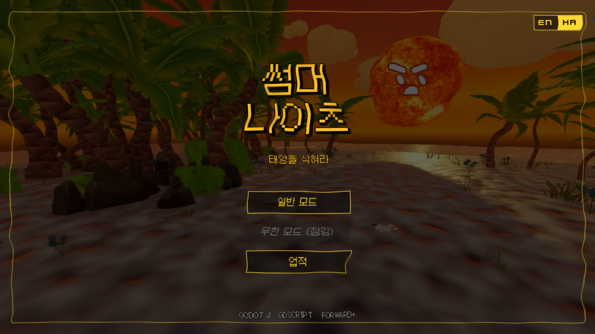
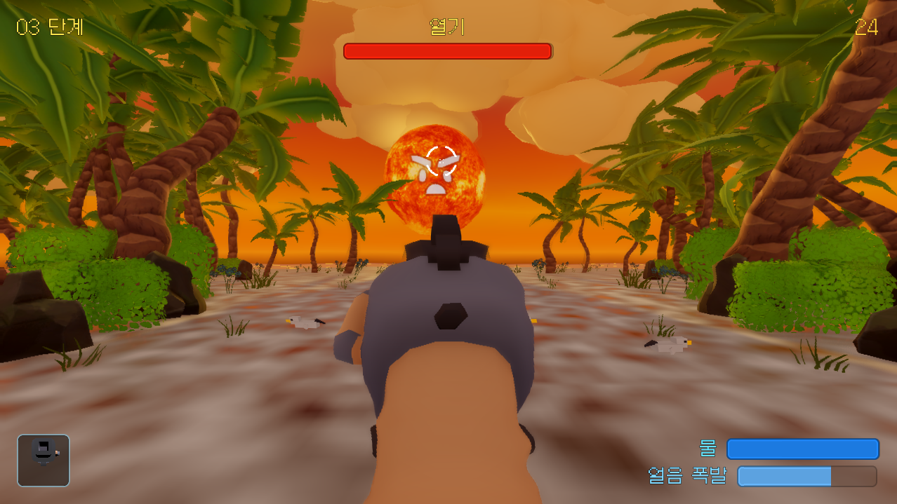
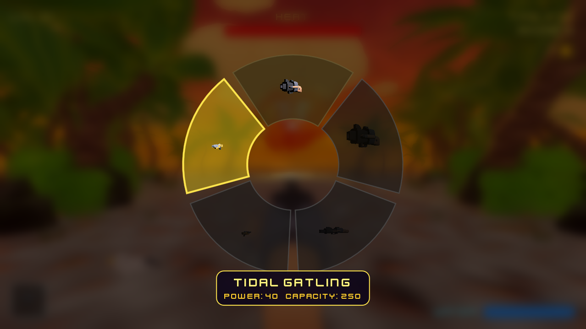
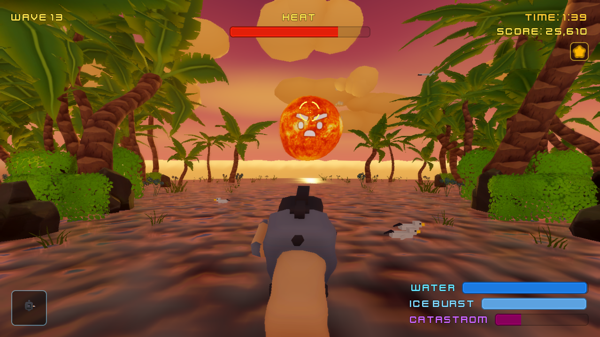
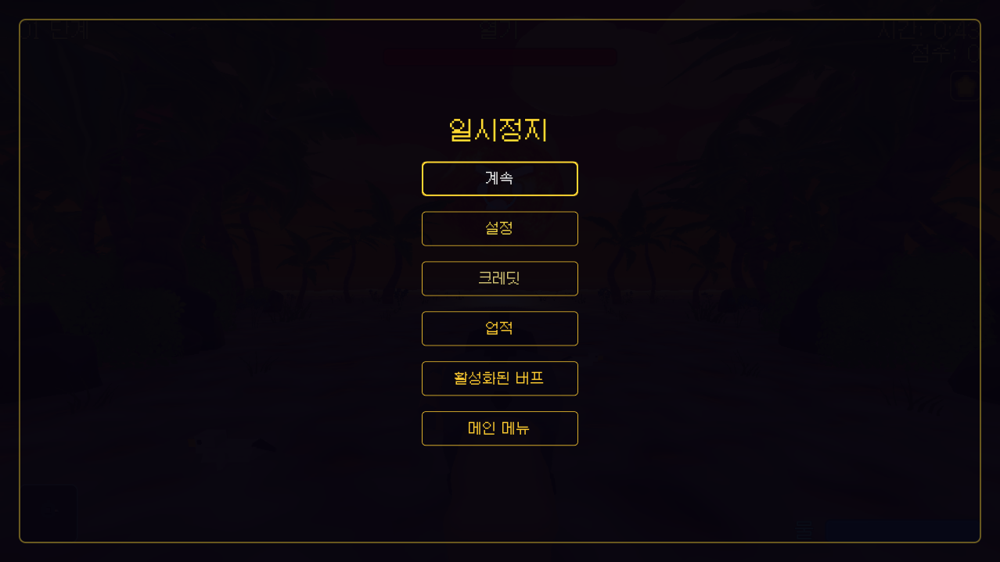
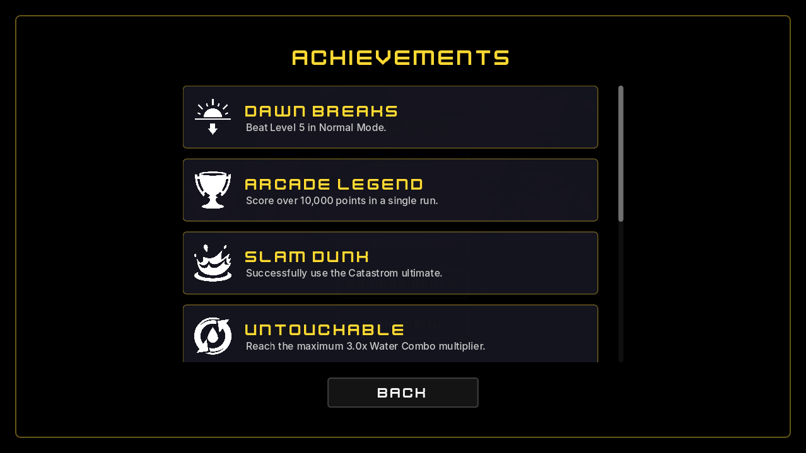
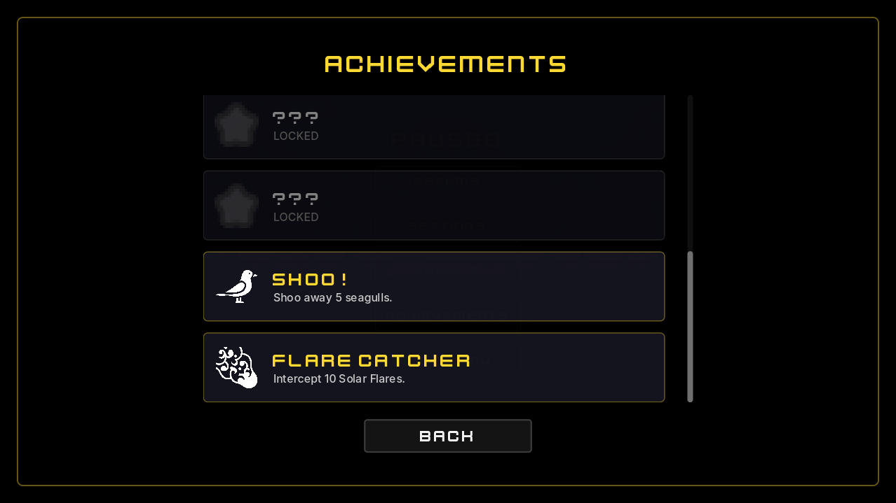
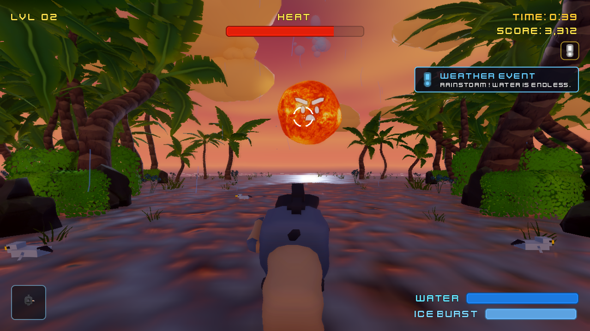
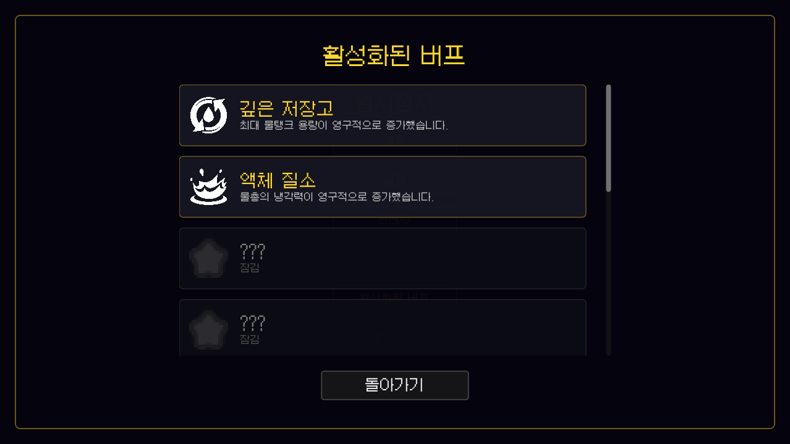

[English](README.md)

# 썸머 나이츠

Godot 4로 제작된 3D 아케이드 슈터. 태양을 식히기 전에 열기에 압도당하지 마세요.

---

## 게임플레이 영상

[](https://www.youtube.com/watch?v=KQT57PJCfZM)

---

## 스크린샷

<table align="center">
  <tr>
    <td align="center"><br><b>타이틀 화면</b></td>
    <td align="center"><br><b>핵심 게임플레이</b></td>
  </tr>
  <tr>
    <td align="center"><br><b>무기 휠</b></td>
    <td align="center"><br><b>카타스트롬 궁극기</b></td>
  </tr>
  <tr>
    <td align="center"><br><b>열기 신기루</b></td>
    <td align="center"><br><b>돌발 파도</b></td>
  </tr>
  <tr>
    <td align="center"><br><b>태양풍</b></td>
    <td align="center"><br><b>일시정지 화면</b></td>
  </tr>
  <tr>
    <td align="center"><br><b>업적 갤러리</b></td>
    <td align="center"><br><b>잠긴 업적</b></td>
  </tr>
  <tr>
    <td align="center"><br><b>날씨 이벤트</b></td>
    <td align="center"><br><b>활성화된 버프</b></td>
  </tr>
</table>

---

## 🎮 게임플레이
- **태양 제압:** 타이머가 종료되기 전에 태양에 물을 뿌려 온도를 0으로 낮추세요! 태양은 시간이 지남에 따라 점차 열기를 회복합니다.
- **5단계 난이도:** 레벨이 올라갈수록 타이머가 짧아지고, 태양의 움직임(좌우 흔들림 및 8자 패턴)이 공격적으로 변하며 열기 회복 속도가 증가합니다.
- **5단계 보스 페이즈:** 마지막 5단계는 태양이 열기를 회복하고 속도가 빨라지는 2단계(Two-phase) 패턴을 특징으로 합니다.
- **패배 조건:** 태양을 식히기 전에 타이머가 0에 도달하면 레벨 실패가 되며 다시 시도해야 합니다.
- **전략적 열 분출구:** 태양 표면에 매우 뜨거운 임계 분출구가 있습니다. 이 지점을 정확히 맞추면 태양을 **2.4배 빠르게** 식힐 수 있습니다.
- **태양 플레어 (불덩이):** 태양이 주기적으로 플레이어를 향해 뜨거운 플레어를 발사합니다. 물줄기로 0.33초 동안 추적하여 공중에서 요격해야 합니다. 플레어를 파괴하면 즉시 **물통이 30% 충전**됩니다.
- **얼음 폭발 (Ice Burst):** 3단계부터 강력한 얼음 폭발 기능이 해제됩니다! 시간이 지나면서 3개의 충전을 모은 후 우클릭(또는 R키)을 눌러 태양을 향해 얼음 조각을 발사하세요. 3초 동안 태양의 모든 움직임과 열기 회복이 완전히 정지됩니다.
- **카타스트롬 궁극기 (Catastrom Ultimate):** 4단계부터 태양에 계속 물을 뿌려 카타스트롬 게이지를 채우세요. 100%에 도달하면 [F] 키를 눌러 태양을 직접 붙잡고 바다로 강하게 끌어내려 즉시 웨이브를 클리어할 수 있습니다!
- **5가지 해제 가능한 무기:** TAB 키를 누르고 있으면 시간이 느려지며 무기 선택 휠이 열립니다. 레벨을 진행하며 새로운 물총을 해제하세요:
  - **표준 블래스터 (1단계):** 균형 잡힌 냉각 파워와 물 소모량.
  - **정밀 스트림 (2단계):** 파워는 약하지만, 정확히 조준할 경우 **4.0배의 치명타 배수**를 자랑합니다.
  - **헤비 캐논 (3단계):** 압도적인 냉각 파워를 가졌지만 물통이 순식간에 고갈됩니다.
  - **스캐터 노즐 (4단계):** 넓은 범위로 분사되어 여러 개의 태양 플레어를 동시에 요격하기 좋지만, 정밀 냉각력이 부족합니다.
  - **타이달 개틀링 ("아케이드 전설" 업적):** 거대한 크기를 자랑하는 폭발형 무기. 극강의 냉각력과 극심한 물 소모량을 가졌지만, 재충전이 매우 깁니다.
- **태양풍 (4단계+):** 주기적으로 태양풍이 불어와 3초 동안 조준을 옆으로 밀어냅니다. 드리프트에 맞서 싸워야 합니다! 경고 표시와 상승하는 윈음이 접근을 알려줍니다.
- **열기 신기루 오버실드 (생존 모드):** 생존 모드에서 5번째 웨이브마다 태양이 2개의 유령 같은 신기루를 생성하고 서로의 위치를 무작위로 섞습니다. 이 신기루들은 태양 본체에 가해지는 모든 피해를 무효화하는 황금색 오버실드를 공유합니다. 태양 본체를 다시 냉각시키려면 반드시 신기루들을 모두 파괴하여 실드를 깨뜨려야 합니다!
---

## 조작법

| 입력 | 동작 |
|---|---|
| 마우스 이동 | 물 대포 조준 |
| 왼쪽 클릭 (유지) | 물 분사 |
| 우클릭 / R | 얼음 폭발 발사 (충전 시) |
| F | 카타스트롬 궁극기 사용 (100% 충전 시) |
| Tab (유지) | 무기 선택 휠 열기 (마우스로 강조, 좌클릭으로 확정) |
| ESC | 설정 / 크레딧 열기 |

---

## 주요 기능

- 물통 자원 관리 — 소진 및 충전 사이클
- 태양 열 분출구 — 치명적 냉각 및 증기 폭발 효과
- 포물선 태양 파편 — 공중 요격 시 물 보충
- 물리적 마그마 파편 — 해변에 추락해 갈매기를 쫓아내며 물총으로 증발시킬 때까지 남아있는 파편
- 물줄기 콤보 시스템 — 태양을 지속적으로 추적할 때 콤보 배율이 최대 3.0배까지 스케일링되어 궁극기 충전을 가속화
- 동적 점수 시스템 — 콤보 배율과 연동되어 지속적인 냉각, 플레어 요격, 파편 증발 시 점수를 부여하며 최고 점수를 영구적으로 저장
- 태양풍 돌풍 — 조준을 옆으로 밀어내는 GPU 파티클 스트릭 시각 효과
- 절차적 생성 3D 구름 (CloudLayer.gd)
- 베지어 곡선 비행 경로, 착륙 로직 및 물 상호작용이 포함된 애니메이션 갈매기 (SeagullLayer.gd)
- 야자수와 덤불의 바람 흔들림 효과
- 하늘, 열기 왜곡, 일시정지 블러, 파도 물결 커스텀 GLSL 셰이더
- WCAG 2.1 AA/AAA 준수 UI — 전체 키보드 탐색, 고대비 모드, 모션 감소, 감도 조절 지원
- `AudioStreamGenerator`를 사용한 코드 합성 절차적 UI 오디오 (호버 틱, 무기 교체음)
- macOS (인텔 + 애플 실리콘 Universal Binary) 및 Windows .exe 출시
- 요격된 태양 플레어에서 스폰되는 물리적 마그마 바위 파편
- 지속적인 타격 시 궁극기가 더 빨리 충전되는 물줄기 콤보 시스템

---

## 실행 방법

1. Godot 4.7.1 (stable) 실행
2. 프로젝트 관리자에서 가져오기 클릭
3. 이 폴더로 이동하여 `project.godot` 선택
4. 가져오기 및 편집 클릭 후 F5 눌러 실행

---

## 프로젝트 구조

```
SummerNights-Godot/
├── project.godot
├── scenes/
│   ├── TitleScreen.tscn      - 타이틀 화면
│   ├── LoadingScreen.tscn    - 로딩 화면
│   ├── Main.tscn             - 3D 게임플레이 씬
│   ├── HUD.tscn              - 2D UI 레이어
│   ├── GameScene.tscn        - 게임 씬
│   └── IceBlast.tscn         - 얼음 폭발 씬
├── scripts/
│   ├── Main.gd               - 핵심 게임 루프, 태양 파편, 분출구, 환경
│   ├── HUD.gd                - HUD, 설정, 크레딧, 크로스헤어, 승리 화면
│   ├── GameScene.gd          - 게임 모드 관리자 (웨이브/무한 모드)
│   ├── WaterGun.gd           - 물총 발사 로직 및 물탱크 용량 관리
│   ├── WeaponWheel.gd        - 무기 선택 UI 및 로직
│   ├── IceBlast.gd           - 얼음 폭발 발사체 물리 및 효과
│   ├── Sun.gd                - 태양 표정 및 반응
│   ├── CloudLayer.gd         - 절차적 생성 3D 구름
│   ├── SeagullLayer.gd       - 애니메이션 갈매기
│   ├── TitleScreen.gd        - 타이틀 화면 상호작용
│   ├── GameState.gd          - 오토로드 상태 (레벨, 볼륨, 접근성, 언어)
│   └── LoadingScreen.gd      - 로딩 화면 전환
└── assets/
    ├── summer_night_sky.gdshader
    ├── heat_haze.gdshader
    ├── stylized_water.gdshader
    ├── sky_gradient.gdshader
    ├── fonts/                - Galmuri11.ttf (한국어 지원)
    ├── models/
    ├── textures/
    └── audio/
```

---

## 기술 스택

| 분야 | 기술 |
|---|---|
| 엔진 | Godot Engine 4.7.1 (stable) |
| 렌더링 | Forward+ (Metal / Vulkan) |
| 언어 | GDScript |
| 후처리 | SSAO, SSIL, SSR, 볼류메트릭 안개, 블룸 |

---

## 크레딧

0% 생성형 AI. 모든 에셋은 수작업, CC0 오픈소스, 또는 절차적 GDScript로 제작되었습니다.

### 주요 팀원 (Core Team)
*   **Ashutos1997** - Product Design & Direction
*   **Ivy** - UI & Visual Designer

### 서드파티 에셋
| 에셋 | 제작자 | 라이선스 |
|---|---|---|
| 3D 태양 모델 - PS1 Style Low Poly Sun | albert_buscio (Sketchfab) | CC0 |
| 3D 총 모델 - 3D Blaster | Kenney | CC0 |
| 식물, 바위, 모래 - Ultimate Stylized Nature | Quaternius | CC0 |
| 양식화된 하늘 셰이더 | MinionsArt | CC0 |
| 양식화된 물 셰이더 | Jtfinlay | MIT |
| 열기 왜곡 셰이더 | MinionsArt | CC0 |
| 폰트 - Kenney Future | Kenney | CC0 |
| 영어 본문 폰트 - Inter | Rasmus Andersson | SIL OFL |
| 한국어 폰트 - Galmuri11 | quiple | SIL OFL |
| UI Pack Adventure | Kenney | CC0 |
| 메뉴 및 업적 아이콘 (Menu & Achievement Icons) | Game-icons.net | CC BY 3.0 |
| SFX - 40가지 CC0 물/물결 효과음 | OpenGameArt | CC0 |
| SFX - 물총 발사음 | belanhud (Freesound) | CC0 |
| SFX - UI 오디오 팩 | Kenney | CC0 |
| SFX - 얼음 발사음 | urupin (Freesound) | CC0 |
| SFX - 얼음 피격음 | antonsoederberg (Freesound) | CC0 |
| SFX - 갈매기 앰비언스 (Seagull Ambiance) | Half-Life | 모드 에셋 (Mod Asset) |
| SFX - PS1 스타일 신스 부팅 오디오 (PS1 Style Synth Boot Audio) | nihilanth217 (SampleFocus) | 표준 라이선스 (Standard License) |
| VFX - 얼음 폭발 발사체 및 입자 효과 | 절차적 고도(Godot) 기본 도형 | - |
| VFX - 물리적 마그마 파편 (Physical Magma Debris) | Quaternius Rock Models 및 Godot RigidBody3D | - |
| 절차적 구름 및 갈매기 | 수작업 GDScript | - |
| 태양 표정 (Sun Face) | 절차적 Godot Image draw API | - |
| 무기 선택 휠 UI | 절차적 GDScript draw API | - |
| 물줄기 콤보 UI 및 로직 (Stream Combo UI) | 절차적 GDScript 및 Tween | - |
| 합성 UI 오디오 (틱/스와이프 소리) | 절차적 AudioStreamGenerator | - |
| VFX 및 오디오 - 태양풍 (Solar Wind) | 절차적 파티클 및 AudioStreamGenerator | - |
| UI 아이콘 - 카타스트롬(Catastrom) | pandora0226 (DeviantArt) | CC BY-NC-ND 3.0 (팬심으로 사용) |
| SFX - 카타스트롬 덩크 (Catastrom Dunk) | Dual Mare Capsem Sound | 공정 이용 (팬 프로젝트) |
| 열기 신기루 (Heat Mirage) | 절차적 반투명 재질 및 Tween (Procedural Materials) | - |

*면책 조항: 가면라이더 및 관련 캐릭터(가면라이더 제츠 포함)는 Toei Company, Ltd. 및 Ishimori Productions의 자산입니다. 본 게임은 비영리적인 비공식 팬 창작물이며 Toei Company와 제휴하거나 보증을 받지 않았습니다.*
