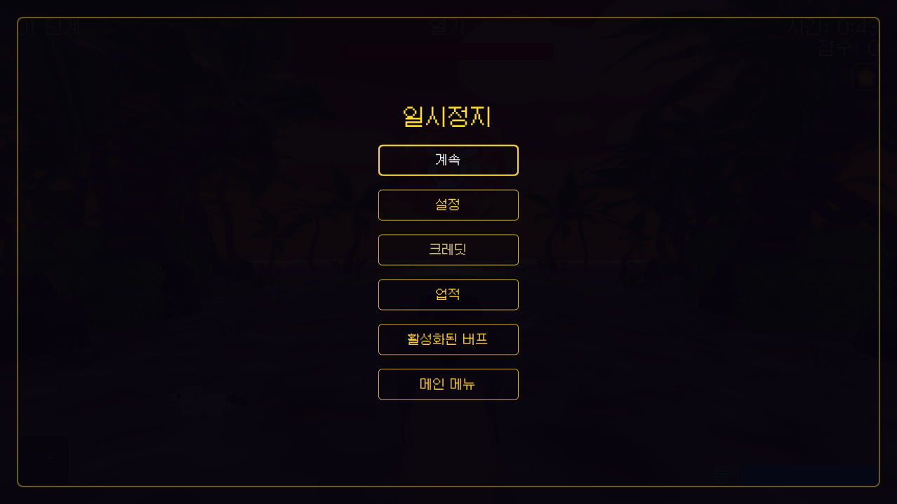
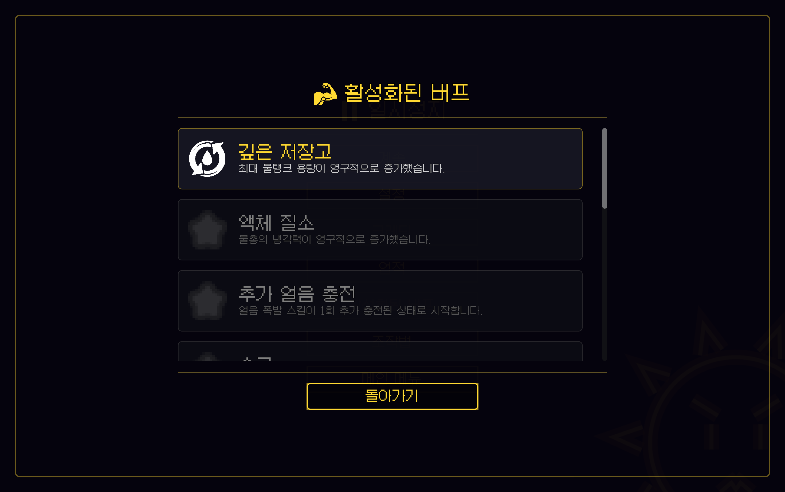
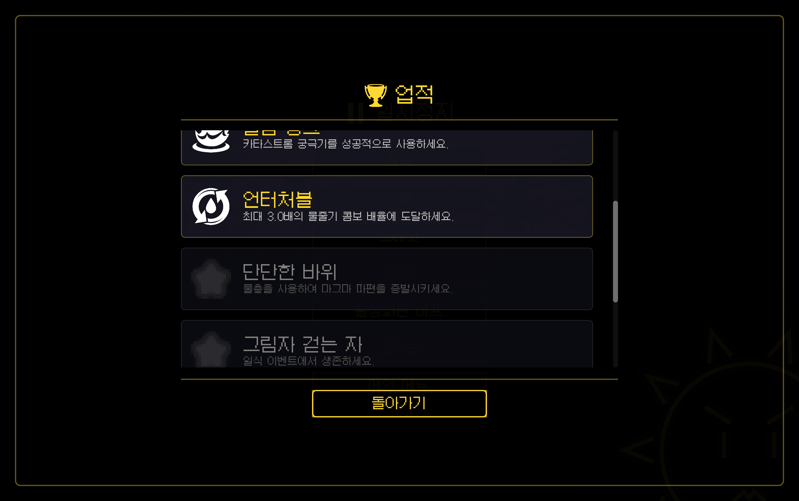
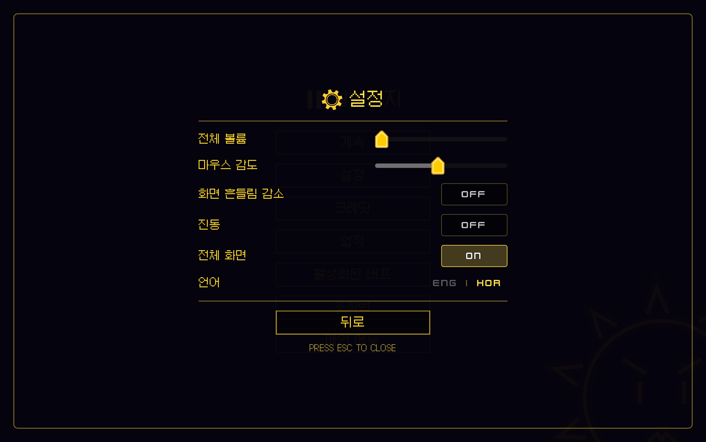
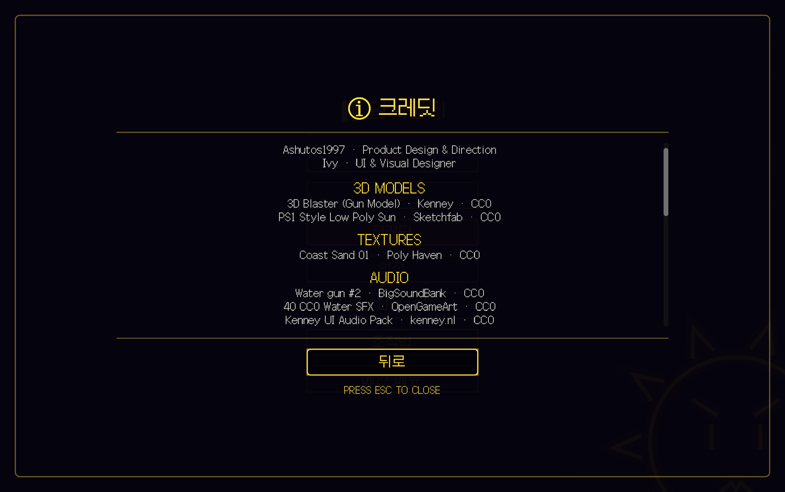
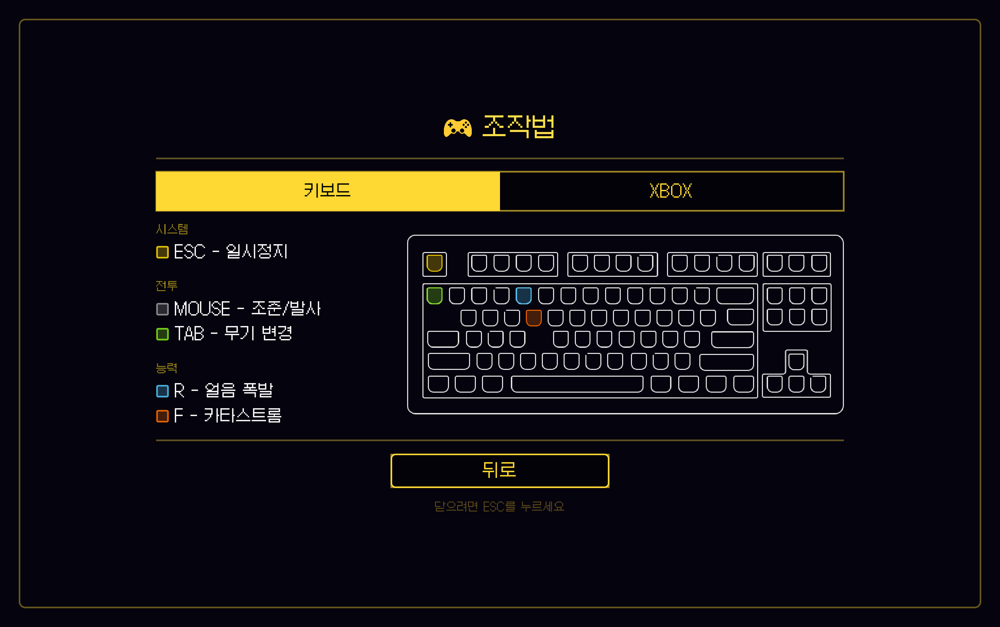
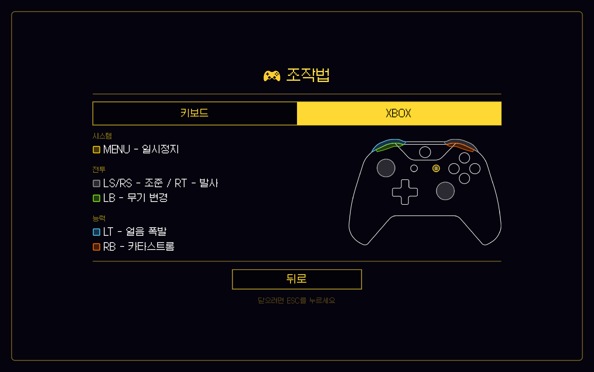

[English](README.md)

# 썸머 나이츠

<div align="center">
  
</div>

Godot 4로 제작된 3D 아케이드 슈터. 태양을 식히기 전에 열기에 압도당하지 마세요.

<div align="center">


*마지막 업데이트: 2026년 9월 · [itch.io에서 플레이](https://ashu1997.itch.io/summer-nights)*

</div>

---

## 게임플레이 영상

[](https://www.youtube.com/watch?v=KQT57PJCfZM)

---

## 스크린샷

<table align="center">
  <tr>
    <td align="center" width="50%"><br><b>타이틀 화면</b></td>
    <td align="center" width="50%"><br><b>핵심 게임플레이</b></td>
  </tr>
  <tr>
    <td align="center"><br><b>무기 휠</b></td>
    <td align="center"><br><b>카타스트롬 (궁극기)</b></td>
  </tr>
  <tr>
    <td align="center"><br><b>아지랑이 환영 (Mirage)</b></td>
    <td align="center"><br><b>다가오는 파도</b></td>
  </tr>
  <tr>
    <td align="center"><br><b>태양풍 (Solar Wind)</b></td>
    <td align="center"><br><b>업적 팝업</b></td>
  </tr>
  <tr>
    <td align="center"><br><b>일시정지 화면</b></td>
    <td align="center"><br><b>활성화된 버프</b></td>
  </tr>
  <tr>
    <td align="center"><br><b>업적 갤러리</b></td>
    <td align="center"><br><b>설정</b></td>
  </tr>
  <tr>
    <td align="center"><br><b>크레딧</b></td>
    <td align="center"><br><b>조작법 (키보드)</b></td>
  </tr>
  <tr>
    <td align="center"><br><b>조작법 (Xbox)</b></td>
    <td align="center"><br><b>알림 팝업</b></td>
  </tr>
</table>

---

## 주요 특징

* **아케이드 냉각 액션:** 제한 시간이 끝나거나 열기가 100%에 도달하기 전에 태양을 식히세요. 지속적인 분사로 콤보 배율을 최대 3.0배까지 쌓아 빠른 점수 획득과 궁극기 충전을 노릴 수 있습니다.
* **전략적 특수 기술:** **얼음 폭발(`R`)**로 열기 회복과 태양 이동을 일시 정지시키거나, 화면 전체를 정리하는 **카타스트롬 궁극기(`F`)**로 태양을 바다에 내리꽂으세요.
* **6종의 해제 무기:** 슬로우 모션 무기 휠(`TAB`)을 통해 치명타 특화 정밀 스트림부터 포격 및 근접 참격 모드를 지원하는 신성의 **구미호 버스터 IX**까지 다양한 블래스터를 활용하세요.
* **역동적인 위협 및 보스전:** 공중에서 태양 플레어를 요격해 물통을 즉시 보충하고, 태양풍 돌풍을 극복하며, 신기루의 오버실드와 다단계 보스 패턴을 격파하세요.
* **게임 모드:** 6개 스테이지로 구성된 일반 모드 캠페인을 공략하거나, 보스 웨이브 후 로그라이트 퍽 드래프트가 제공되는 무한 모드에서 한계에 도전하세요.
* **감각적인 레트로 그래픽:** 로우폴리 3D 비주얼, 절차적 바다 물결, 커스텀 GLSL 하늘/열기 셰이더, 레트로 CRT/PS1 필터 및 다양한 접근성 옵션(게임패드 지원, 고대비, 모션 감소)을 제공합니다.

---

## 조작법

| 입력 | 동작 |
|---|---|
| 마우스 | 물 대포 조준 |
| 좌클릭 (유지) | 물 분사 |
| 우클릭 / R | 얼음 폭발 발사 (충전 시) |
| F | 카타스트롬 궁극기 사용 (100% 충전 시) |
| Tab (유지) | 무기 선택 휠 열기 |
| ESC | 일시정지 / 설정 |

---

## 실행 방법

1. **Godot Engine 4.7.1** (stable) 실행
2. 프로젝트 관리자에서 **가져오기**를 클릭하고 `project.godot` 선택
3. **가져오기 및 편집** 클릭 후 **F5** 키를 눌러 실행

---

## 프로젝트 구조

```
SummerNights-Godot/
├── assets/          # 3D 모델, 텍스처, 사운드 효과음 및 셰이더
├── docs/            # 시스템 아키텍처, HUD 레퍼런스 및 패치 노트
├── scenes/          # 핵심 게임플레이, HUD 및 메뉴 씬
└── scripts/         # 게임 루프, 무기 메커니즘 및 게임 상태 관리
```

---

## 기술 스택

| 분야 | 기술 |
|---|---|
| 엔진 | Godot Engine 4.7.1 |
| 언어 | GDScript |
| 렌더링 | Forward+ (Metal / Vulkan) |
| 후처리 | 블룸, SSAO, SSIL, SSR, 볼류메트릭 안개, 커스텀 GLSL 셰이더 |

---

## 크레딧

0% 생성형 AI. 모든 에셋은 수작업, CC0 오픈소스, 또는 절차적 GDScript로 제작되었습니다.

### 주요 팀원 (Core Team)
*   **Ash J** - 게임 기획 및 디렉션
*   **Ivy** - UI 및 시각 디자인

### 특별한 감사 (Special Thanks)
*   **Yodi (요디님) & 카카오톡 디자인 클럽** - 초기 콘셉트 영감 제공

### 서드파티 에셋
| 에셋 | 제작자 | 라이선스 |
|---|---|---|
| 3D 태양 모델 - PS1 Style Low Poly Sun | albert_buscio (Sketchfab) | CC0 |
| 3D 총기 모델 - 3D Blaster | Kenney | CC0 |
| 3D 총기 모델 - 구미호 버스터 IX (포격 및 검 모드) | 절차적 파이썬 glTF 합성 (Procedural Python glTF Synthesis) | 오픈소스 (Open Source) |
| 3D 모델 - 태양 궤도 아이 드론 ("헬리오스 드론") | 절차적 파이썬 glTF 합성 (Procedural Python glTF Synthesis) | 오픈소스 (Open Source) |
| 식물 및 바위 - Ultimate Stylized Nature | Quaternius | CC0 |
| 모래 텍스처 - Coast Sand 01 | Poly Haven | CC0 |
| 양식화된 하늘 셰이더 | MinionsArt | CC0 |
| 양식화된 물 셰이더 | Jtfinlay | MIT |
| 열기 왜곡 셰이더 | MinionsArt | CC0 |
| 폰트 - Kenney Future | Kenney | CC0 |
| 영어 본문 폰트 - Inter | Rasmus Andersson | SIL OFL |
| 한국어 폰트 - Galmuri11 | quiple | SIL OFL |
| UI Pack Adventure | Kenney | CC0 |
| 컨트롤러 SVGs (Controller SVGs) | Oscar Nilsson | CC0 |
| 고도 엔진 로고 및 브랜딩 (Godot Engine Logo) | Andrea Calabró (Godot Foundation) | CC BY 4.0 |
| 메뉴 및 업적 아이콘 (Menu & Achievement Icons) | Game-icons.net | CC BY 3.0 |
| UI 및 퍽 벡터 아이콘 (얼음 창, 극저온 온도계, 태양, 열린 자물쇠, 드론, 분쇄) | Game-icons.net (Lorc, Delapouite) | CC BY 3.0 |
| HUD 미터 아이콘 (HUD Meter Icons) | Yudhi Restu Pebriyanto, Jaya99, balyanbinmalkan (Noun Project) | CC BY 3.0 |
| UI - 신성의 성광 미터 아이콘 (Celestial Starburst Meter Icon) | 수작업 SVG 벡터 아이콘 (Hand-crafted SVG Vector Icon) | CC0 |
| SFX - 40가지 CC0 물/물결 효과음 | OpenGameArt | CC0 |
| SFX - 물총 발사음 | belanhud (Freesound) | CC0 |
| SFX - UI 오디오 팩 | Kenney | CC0 |
| SFX - 얼음 발사음 | urupin (Freesound) | CC0 |
| SFX - 얼음 피격음 | antonsoederberg (Freesound) | CC0 |
| SFX - 실드 파괴음 (Shield Shatter) | IgnasD (OpenGameArt) | CC0 |
| SFX - 실드 생성음 (Shield Materialize) | bart (OpenGameArt) | CC0 |
| SFX - 실드 튕김음 (Shield Deflection) | OpenGameArt | CC0 |
| SFX - 드론 금속성 타격음 4종 (Drone Metallic Impacts) | rubberduck (OpenGameArt) | CC0 |
| SFX - 드론 기계 파열 및 유리 분쇄음 (Drone Shatter SFX) | rubberduck (OpenGameArt) | CC0 |
| SFX - 구미호 검 발도 및 참격음 (Kitsune Blade Draw) | artisticdude (OpenGameArt) | CC0 |
| SFX - 드라이버 버클 체결 및 캐논 잠금음 (Driver & Cannon Lock) | OpenGameArt | CC0 |
| SFX - 오버드라이브 경보 및 황금 방어막 앰비언스 (Overdrive & Forcefield) | Kenney | CC0 |
| SFX - 퍽 카드 드래프트, 호버 및 선택 효과음 (Perk Card SFX) | Kenney | CC0 |
| SFX - 신성의 각성 활성화음 (Celestial Awakening Activation) | TheLittleCrow (Freesound) | CC0 |
| SFX - 신성의 각성 비활성화음 (Celestial Awakening Deactivation) | bevibeldesign (Freesound) | CC0 |
| SFX - 신성의 참격 효과음 (Celestial Blade Slash) | Nomagician (Freesound) | CC0 |
| SFX - 전술 모드 전환 효과음 (Tactical Mode Switch) | Kenney | CC0 |
| SFX - 갈매기 앰비언스 (Seagull Ambiance) | Half-Life | 모드 에셋 (Mod Asset) |
| SFX - PS1 스타일 신스 부팅 오디오 (PS1 Style Synth Boot Audio) | nihilanth217 (SampleFocus) | 표준 라이선스 (Standard License) |
| SFX - 심장 박동음 (죽음의 문턱) (Heartbeat - Death's Door) | Wikimedia Commons | 퍼블릭 도메인 (Public Domain) |
| SFX - 빈 탱크 클릭음 (Empty Tank Click) | 절차적 파이썬 스크립트 합성 (Procedural Python Script Synthesis) | 오픈소스 (Open Source) |
| SFX - 초신성 충돌 오디오 (안전 배포용) (Supernova Impact Audio - Safe Export) | Uzbazur (Freesound) | CC0 |
| VFX - 얼음 폭발 발사체 및 입자 효과 | 절차적 고도(Godot) 기본 도형 | - |
| VFX - 물리적 마그마 파편 (Physical Magma Debris) | Quaternius Rock Models 및 Godot RigidBody3D | - |
| VFX - 태양 플레어 실드 및 튕김 연출 (Solar Flare Shield & Deflection FX) | 절차적 프레넬 셰이더 및 외곽 튕김 파티클 | - |
| 절차적 구름 및 다관절 날개 갈매기 (Clouds & Avian Rigged Seagulls) | 수작업 GDScript 및 다관절 비행 모델 | - |
| VFX - 반딧불이 및 벌레 (Fireflies & Bugs) | 절차적 GDScript ArrayMesh | - |
| 태양 표정 (Sun Face) | 절차적 Godot Image draw API | - |
| 무기 선택 휠 UI | 절차적 GDScript draw API | - |
| 동적 무기 조준선 (Dynamic Weapon Crosshairs) | 절차적 GDScript draw API | - |
| 물줄기 콤보 UI 및 로직 (Stream Combo UI) | 절차적 GDScript 및 Tween | - |
| 합성 UI 오디오 (틱/스와이프 소리) | 절차적 AudioStreamGenerator | - |
| VFX 및 오디오 - 태양풍 (Solar Wind) | 절차적 파티클 및 AudioStreamGenerator | - |
| UI 아이콘 - 카타스트롬(Catastrom) | pandora0226 (DeviantArt) | CC BY-NC-ND 3.0 (팬심으로 사용) |
| SFX - 카타스트롬 덩크 (Catastrom Dunk) | Dual Mare Capsem Sound | 공정 이용 (팬 프로젝트) |
| 열기 신기루 (Heat Mirage) | 절차적 반투명 재질 및 Tween (Procedural Materials) | - |
| 부트 스플래시 프레임 및 커튼 연출 (Boot Splash Frame & Curtain) | 절차적 CanvasItem 드로잉 및 벡터 애니메이션 | - |
| VFX - 대기 코로나 헤일로 및 동심원 열파 (Coronal Halo & Heat Ripples) | 절차적 무음영 가산 혼합 셰이더 및 지오메트리 | - |
| VFX - 태양 플레어 요격 골든 엠버 팝 (Flare Interception Ember Pop) | 절차적 방사형 파티클 및 블룸 | - |
| UI - 기록 및 업적 아이콘 플레이트 (Stats & Achievement Icon Plates) | 절차적 레트로 플랫 플레이트 및 틴트 벡터 아이콘 | - |
| VFX - 신성의 각성 9미 수류 리본 (Celestial Awakening 9-Tail Hydro-Ribbons) | 절차적 3D 지오메트리 및 파동 | - |
| VFX - 9갈래 집중 수류포 & 창조 오라 (9-Stream Converging Cannon & Aura) | 절차적 나선 볼텍스 및 플레어 왜곡 | - |
| VFX - 신성의 수류검 및 검신 리본 (Celestial Hydro-Blade & Water Cutting) | 절차적 메시 수류 칼집 및 나선 궤도 | - |
| VFX - 영역 분할 3D 후처리 셰이더 (Ethereal Domain Post-Process Shader) | 스플릿 토닝, 변신 충격파 및 아나모픽 플레어 | - |
| VFX - 신성의 방사형 에너지 비네트 셰이더 (Celestial Radial Energy Vignette) | 절차적 에너지 펄스 및 스타더스트 입자 | - |
| VFX - 신성의 여우불 참격 검기 (Celestial Foxfire Slash Wave) | ImmediateMesh 초승달 화염 및 스파크 궤적 | - |

*면책 조항: 가면라이더 및 관련 캐릭터(가면라이더 제츠 및 가면라이더 기츠 포함)는 Toei Company, Ltd. 및 Ishimori Productions의 자산입니다. 본 게임은 비영리적인 비공식 팬 창작물이며 Toei Company와 제휴하거나 보증을 받지 않았습니다.*
