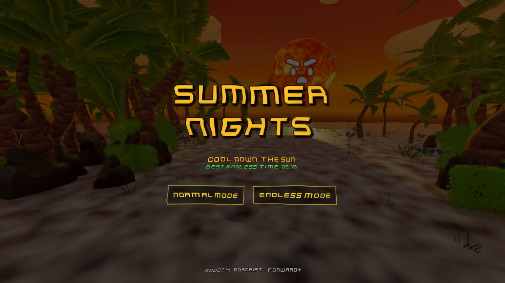
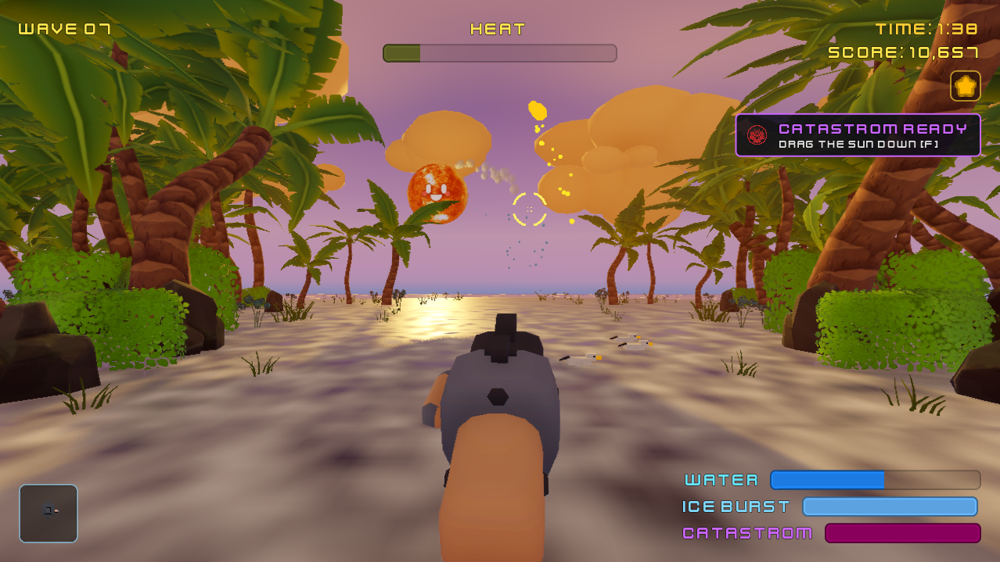
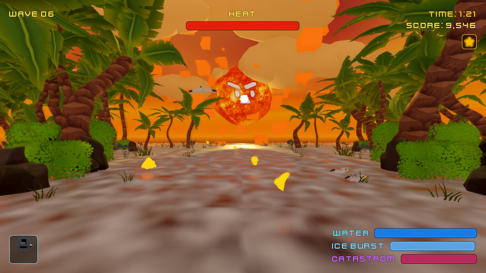
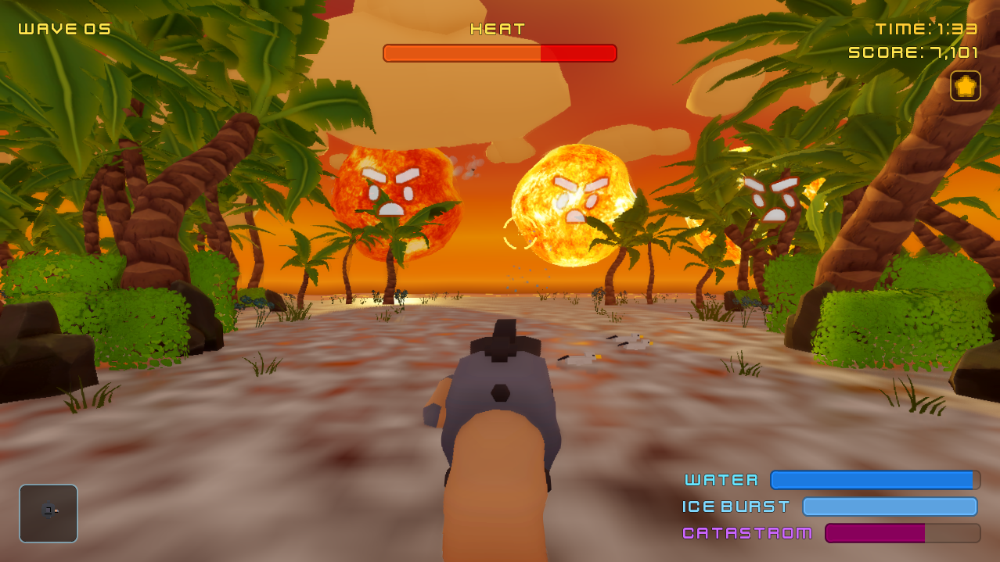
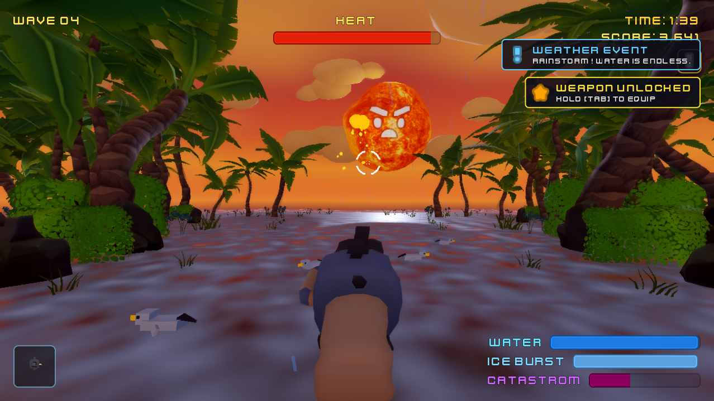
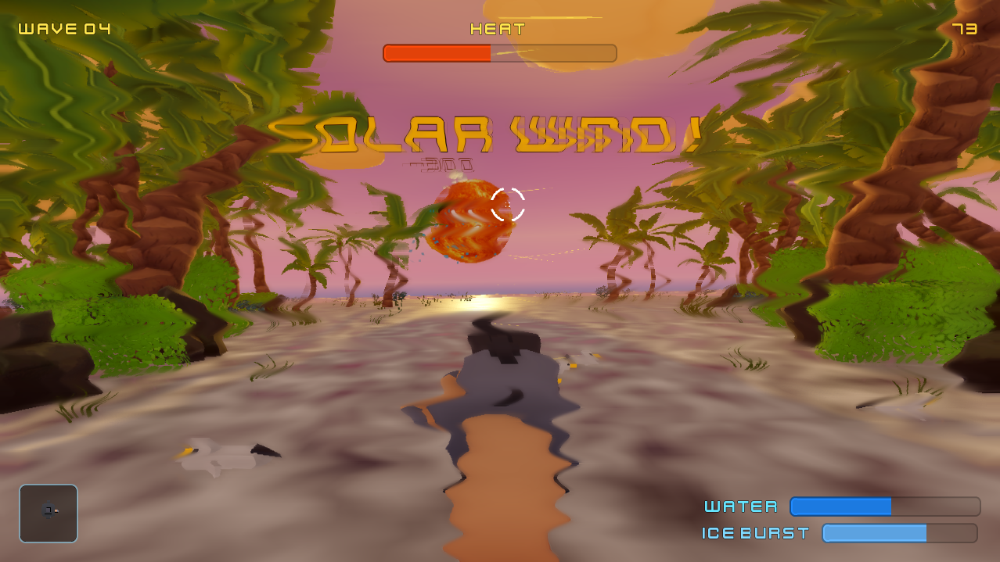
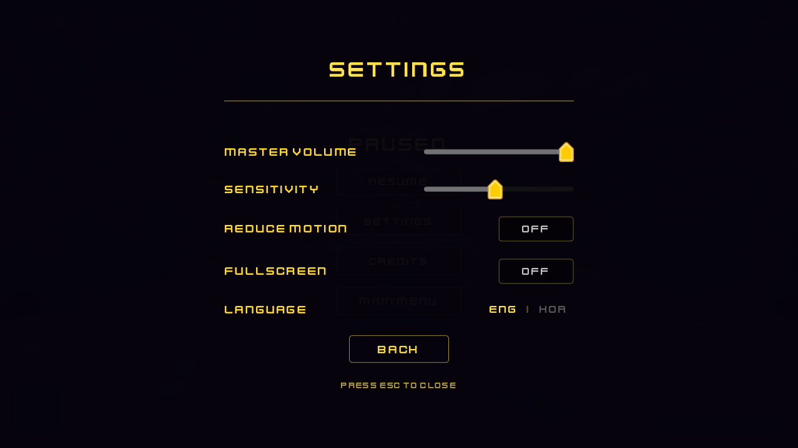

[한국어](README.ko.md)

# Summer Nights

A 3D arcade shooter built in Godot 4. Cool down the Sun before the heat overwhelms you.

---

## Screenshots

<p align="center">
  
  
  <br>
  
  
  <br>
  
  
  <br>
  
  
</p>

---

## 🎮 Gameplay
- **Defeat the Sun:** Water the sun to drop its temperature down to 0 before the timer expires! The sun gradually recovers heat over time.
- **5-Level Difficulty:** Each level gets harder with shorter timers, aggressive sun movement (sway and figure-8 paths), and increased heat regeneration.
- **Level 5 Boss Phase:** The final level features a two-phase encounter where the sun regains heat and speeds up.
- **Lose Condition:** If the timer reaches 0 before the sun is defeated, you lose the level and must retry.
- **Strategic Heat Vents:** The sun has a white-hot critical vent on its surface. Hitting this spot directly cools the sun **2.4x faster**.
- **Solar Flares (Fireballs):** The sun periodically launches fiery solar flares towards you. You must intercept them mid-air by tracking them with the water stream for 0.33s. Destroying a flare rewards an instant **+30% Water Tank refill**.
- **Ice Burst:** Starting in Level 3, unlock the powerful Ice Burst mechanic! Build up 3 charges over time and right-click (or press R) to fire a freezing shard at the sun, completely stopping all sun movement and heat regeneration for 3 seconds.
- **Catastrom Ultimate:** In Level 4+, fill the Catastrom gauge by continuously watering the sun. When it hits 100%, press [F] to physically grab the sun and violently drag it down into the ocean to instantly clear the wave!
- **4 Unlockable Weapons:** Hold TAB to slow time and open the weapon wheel. Unlock new water blasters as you progress:
  - **Standard Blaster (Lvl 1):** Balanced cooling power and water drain.
  - **Precision Stream (Lvl 2):** Low power, but features a massive **4.0x Critical Hit multiplier** for perfect aim.
  - **Heavy Cannon (Lvl 3):** Extreme raw cooling power, but drains your water tank incredibly fast.
  - **Scatter Nozzle (Lvl 4):** Wide spread, excellent for intercepting multiple solar flares at once, but lacks pinpoint cooling.
- **Solar Wind (Level 4+):** Periodic gusts of solar wind push your aim sideways for 3 seconds, forcing you to fight the drift. A warning flashes before each gust — brace yourself! Particle streaks and a rising hum signal the incoming blast.
---

## Controls

| Input | Action |
|---|---|
| Move mouse | Aim the water cannon |
| Left click (hold) | Fire water spray |
| Right click / R | Fire Ice Burst (when charged) |
| F | Activate Catastrom Ultimate (when 100% charged) |
| Tab (hold) | Open Weapon Selection Wheel (Mouse to highlight, Left Click to confirm) |
| ESC | Open Settings / Credits |

---

## Features

- Water tank resource management with drain and recharge cycle
- Solar heat vents with critical cooling and steam geyser effects
- Solar flare projectiles in parabolic arcs, interceptable for water refills
- Physical magma rock debris that crashes onto the beach, scaring away seagulls and persisting until evaporated by the water gun
- Water stream combo system that scales your combo multiplier up to 3.0x for continuous tracking, boosting Catastrom ultimate charging
- Dynamic Scoring System intertwined with the combo multiplier, rewarding continuous cooling, flare interceptions, and debris evaporation, while saving your high score persistently
- Solar wind gusts that push your aim sideways with GPU particle streak visuals
- Procedural drifting 3D low-poly clouds (CloudLayer.gd)
- Fully animated low-poly seagulls with curved Bezier flight paths, landing logic, and water interactions (SeagullLayer.gd)
- Wind sway on palm trees and bushes
- Custom GLSL shaders for sky, heat haze, pause blur, and ocean ripples
- WCAG 2.1 AA/AAA compliant UI with full keyboard navigation, high-contrast mode, reduce motion, and adjustable sensitivity
- Code-synthesized procedural UI audio (hover ticks, weapon swooshes) using `AudioStreamGenerator`
- Exported as Universal Binary (macOS Intel + Apple Silicon) and Windows .exe

---

## Running the Project

1. Open Godot 4.7.1 (stable)
2. In the Project Manager, click Import
3. Navigate to this folder and select `project.godot`
4. Click Import & Edit, then press F5 to run

---

## Project Structure

```
SummerNights-Godot/
├── project.godot
├── scenes/
│   ├── TitleScreen.tscn
│   ├── LoadingScreen.tscn
│   ├── Main.tscn
│   ├── HUD.tscn
│   ├── GameScene.tscn
│   └── IceBlast.tscn
├── scripts/
│   ├── Main.gd               - Core game loop, solar flares, vents, environment
│   ├── HUD.gd                - HUD, settings, credits, crosshair, victory screens
│   ├── GameScene.gd          - Game mode manager (Wave/Endless)
│   ├── WaterGun.gd           - Water gun shooting logic and capacity
│   ├── WeaponWheel.gd        - Weapon selection UI and logic
│   ├── IceBlast.gd           - Ice blast projectile physics and effects
│   ├── Sun.gd                - Sun face expressions and reactions
│   ├── CloudLayer.gd         - Procedural drifting 3D clouds
│   ├── SeagullLayer.gd       - Animated low-poly seagulls
│   ├── TitleScreen.gd        - Title screen interactions
│   ├── GameState.gd          - Autoload state (level, volume, accessibility)
│   └── LoadingScreen.gd      - Loading screen transitions
└── assets/
    ├── summer_night_sky.gdshader
    ├── heat_haze.gdshader
    ├── stylized_water.gdshader
    ├── sky_gradient.gdshader
    ├── models/
    ├── textures/
    └── audio/
```

---

## Tech Stack

| Area | Technology |
|---|---|
| Engine | Godot Engine 4.7.1 (stable) |
| Rendering | Forward+ (Metal / Vulkan) |
| Language | GDScript |
| Post-FX | SSAO, SSIL, SSR, Volumetric Fog, Bloom |

---

## Credits

0% GenAI. All assets are hand-crafted, CC0 open-source, or procedural GDScript.

| Asset | Author | License |
|---|---|---|
| 3D Sun Model - PS1 Style Low Poly Sun | albert_buscio (Sketchfab) | CC0 |
| 3D Gun Model - 3D Blaster | Kenney | CC0 |
| Foliage, Rocks, Sand - Ultimate Stylized Nature | Quaternius | CC0 |
| Stylized Sky Shader | MinionsArt | CC0 |
| Stylized Water Shader | Jtfinlay | MIT |
| Heat Haze Screen Distortion | MinionsArt | CC0 |
| Font - Kenney Future | Kenney | CC0 |
| Font - Galmuri11 (Korean Support) | quiple | SIL OFL |
| UI Pack Adventure | Kenney | CC0 |
| SFX - 40 CC0 Water/Splash/Slime | OpenGameArt | CC0 |
| SFX - Water Gun Shot | belanhud (Freesound) | CC0 |
| SFX - UI Audio Pack | Kenney | CC0 |
| SFX - Ice Shoot | urupin (Freesound) | CC0 |
| SFX - Ice Hit | antonsoederberg (Freesound) | CC0 |
| SFX - Seagull Ambiance | Half-Life | Mod Asset |
| VFX - Ice Blast Projectile & Particles | Procedural Godot Primitives | - |
| VFX - Physical Magma Debris | Quaternius Rock Models & Godot RigidBody3D | - |
| Procedural Clouds and Seagulls | Hand-crafted GDScript | - |
| Sun Face Expressions | Procedural Godot Image draw API | - |
| Weapon Wheel UI | Procedural GDScript draw API | - |
| Stream Combo UI & Logic | Procedural GDScript & Tweens | - |
| Synthesized UI Audio (Ticks/Whoosh) | Procedural AudioStreamGenerator | - |
| VFX & Audio - Solar Wind Hazard | Procedural Particles & AudioStreamGenerator | - |
| UI Icon - Catastrom Powerup | pandora0226 (DeviantArt) | CC BY-NC-ND 3.0 (Used for fun) |
| SFX - Catastrom Dunk | Dual Mare Capsem Sound | Fair Use (Fan Project) |

*Disclaimer: Kamen Rider and related characters (including Kamen Rider Zeztz) are the property of Toei Company, Ltd. and Ishimori Productions. This game is a non-profit, unofficial fan work and is not affiliated with or endorsed by Toei Company.*
