[한국어](README.ko.md)

# Summer Nights

<div align="center">
  
</div>

A 3D arcade shooter built in Godot 4. Cool down the Sun before the heat overwhelms you.

<div align="center">


*Last updated: September 2026 · [Play on itch.io](https://ashu1997.itch.io/summer-nights)*

</div>

---

## Gameplay Video

[](https://www.youtube.com/watch?v=KQT57PJCfZM)

---

## Screenshots

<table align="center">
  <tr>
    <td align="center" width="50%">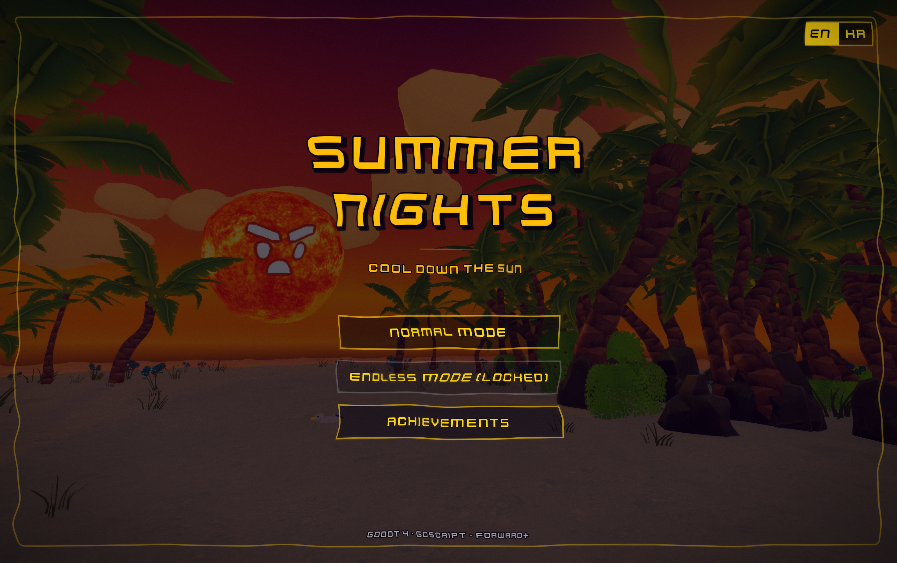<br><b>Title Screen</b></td>
    <td align="center" width="50%">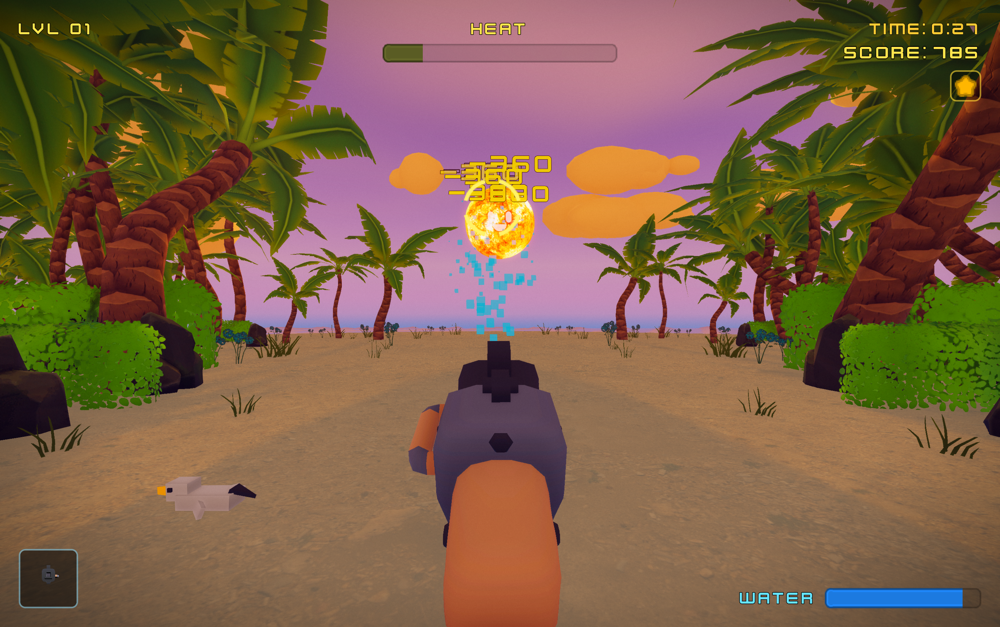<br><b>Core Gameplay</b></td>
  </tr>
  <tr>
    <td align="center">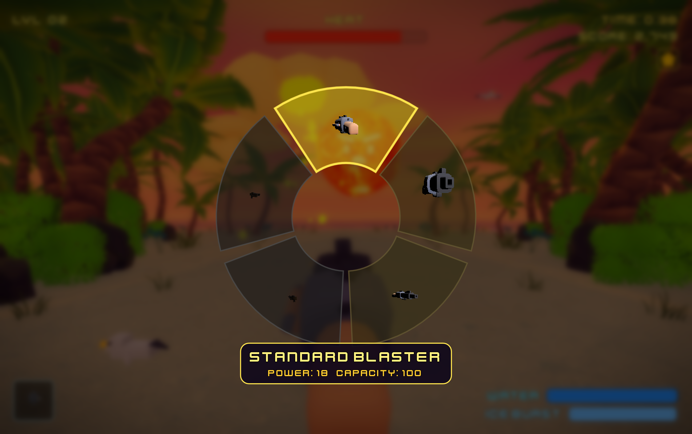<br><b>Weapon Wheel</b></td>
    <td align="center">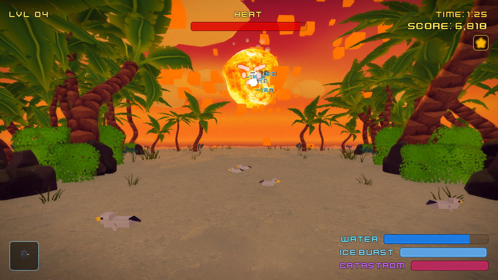<br><b>Catastrom Ultimate</b></td>
  </tr>
  <tr>
    <td align="center">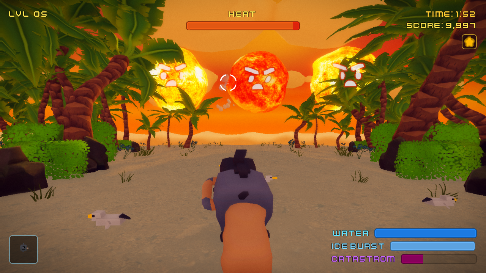<br><b>Heat Mirage</b></td>
    <td align="center">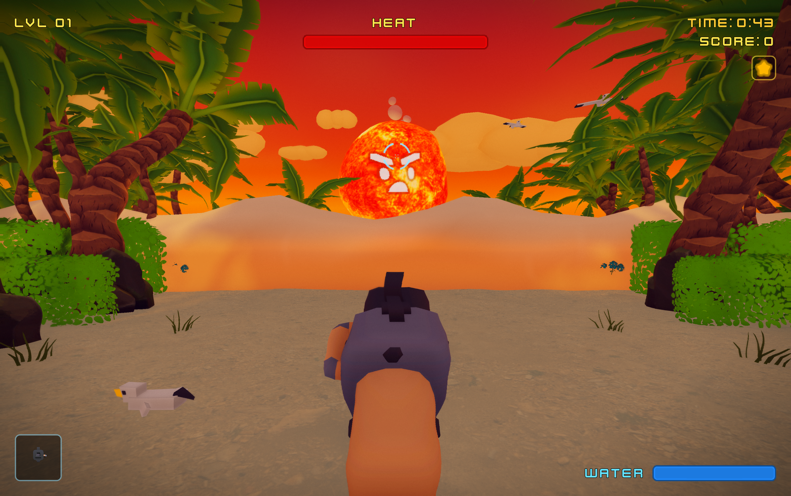<br><b>Incoming Wave</b></td>
  </tr>
  <tr>
    <td align="center">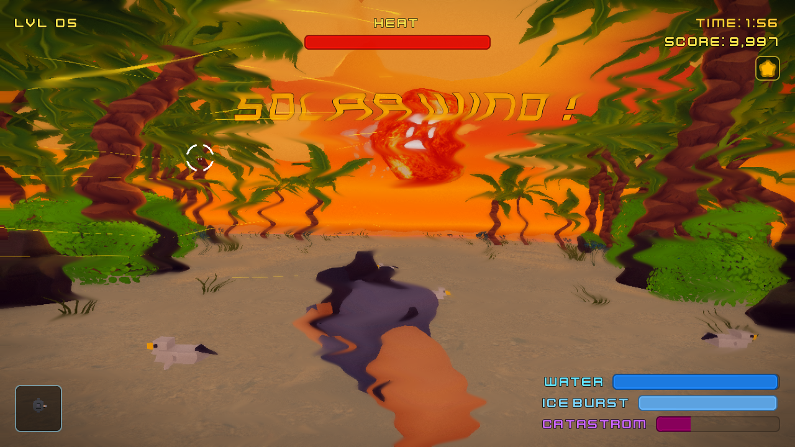<br><b>Solar Wind</b></td>
    <td align="center">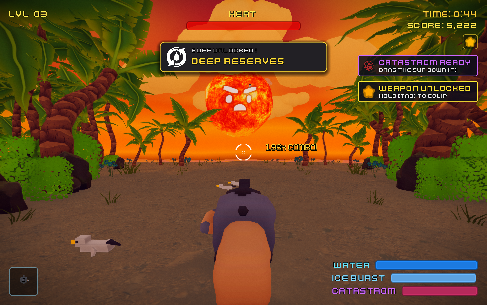<br><b>Achievement Pop-Ups</b></td>
  </tr>
  <tr>
    <td align="center">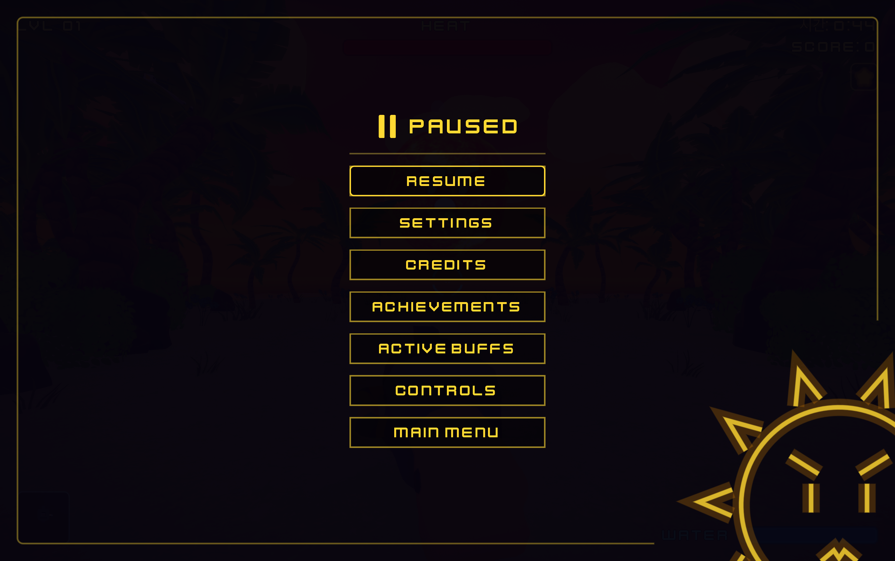<br><b>Pause Screen</b></td>
    <td align="center">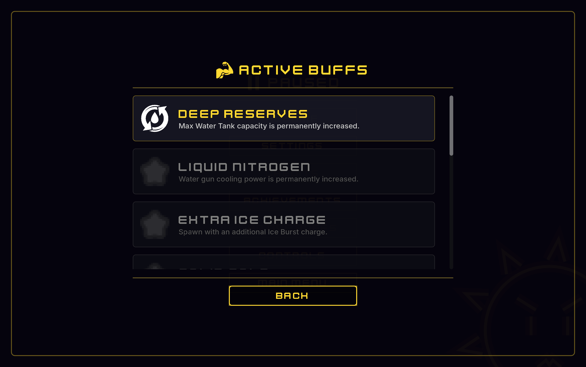<br><b>Active Buffs</b></td>
  </tr>
  <tr>
    <td align="center">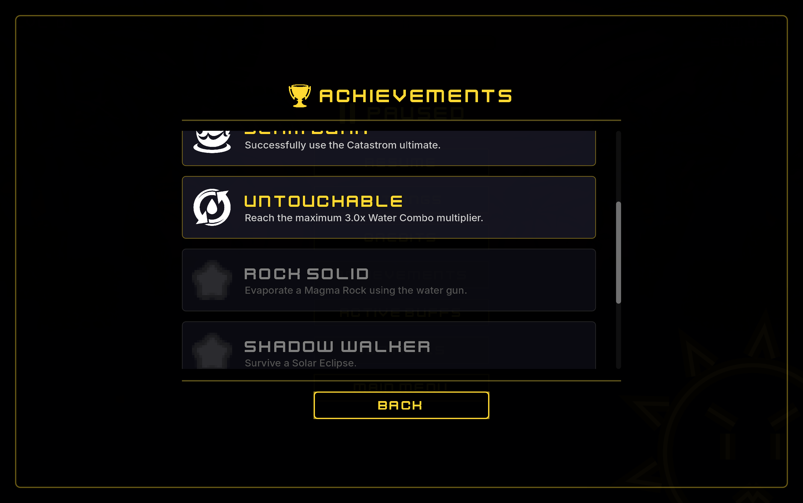<br><b>Achievements Gallery</b></td>
    <td align="center">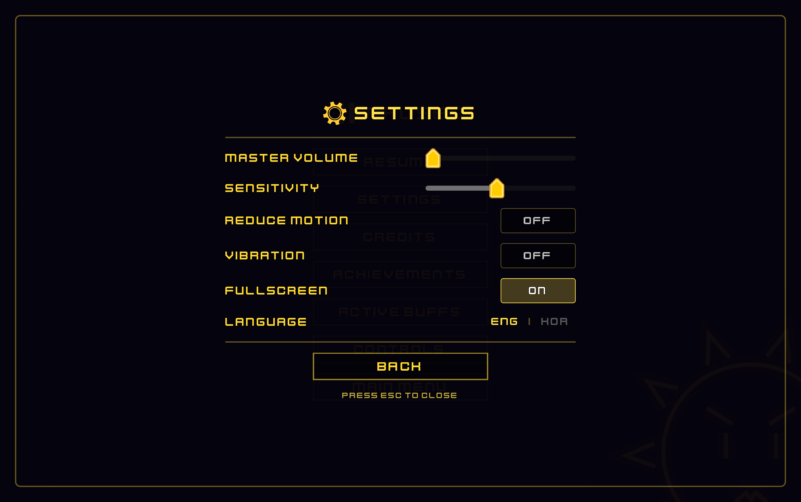<br><b>Settings</b></td>
  </tr>
  <tr>
    <td align="center">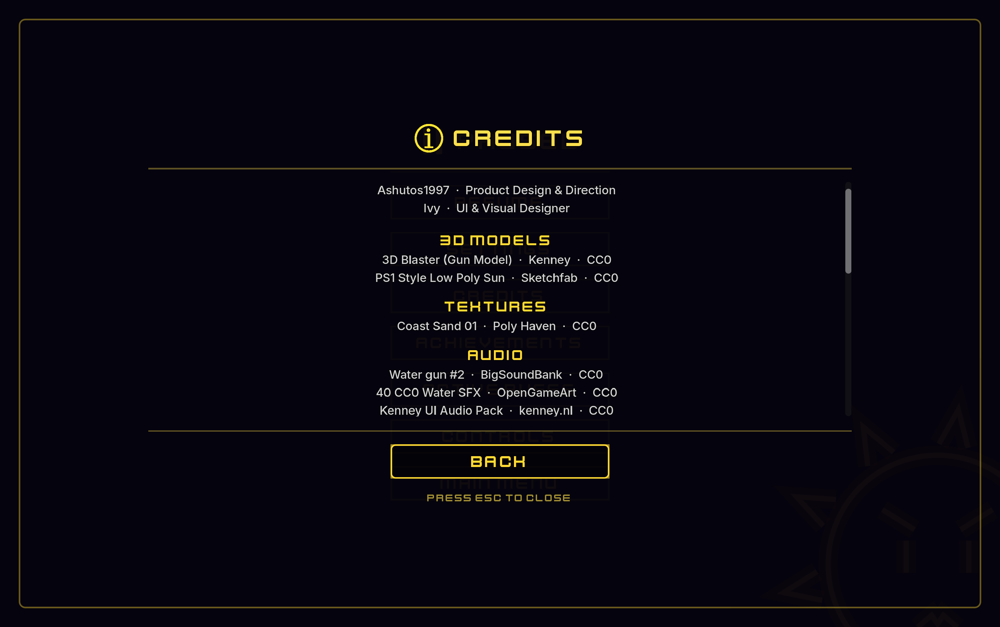<br><b>Credits</b></td>
    <td align="center">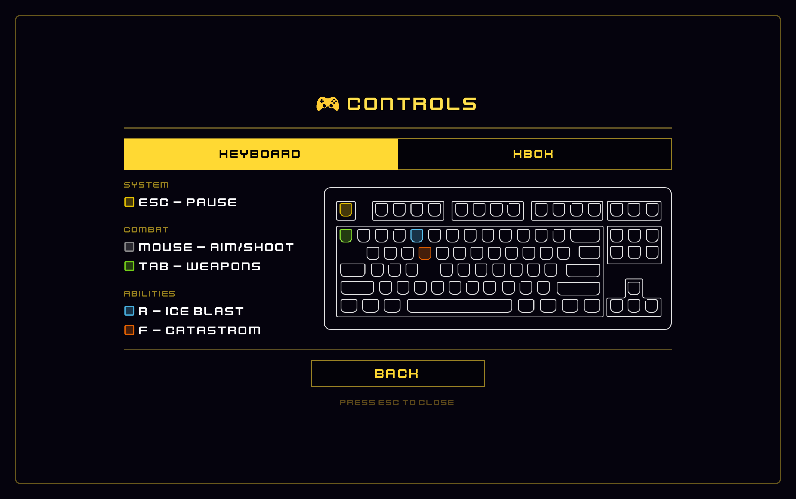<br><b>Controls (Keyboard)</b></td>
  </tr>
  <tr>
    <td align="center">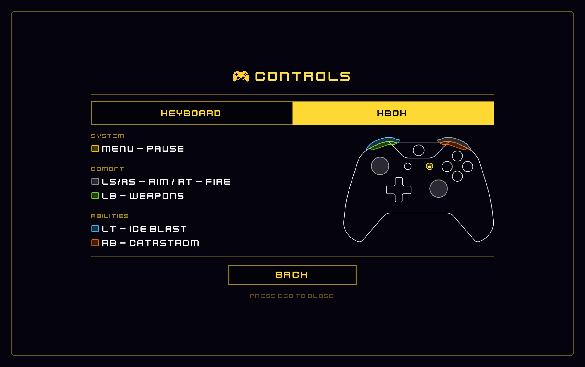<br><b>Controls (Xbox)</b></td>
    <td align="center">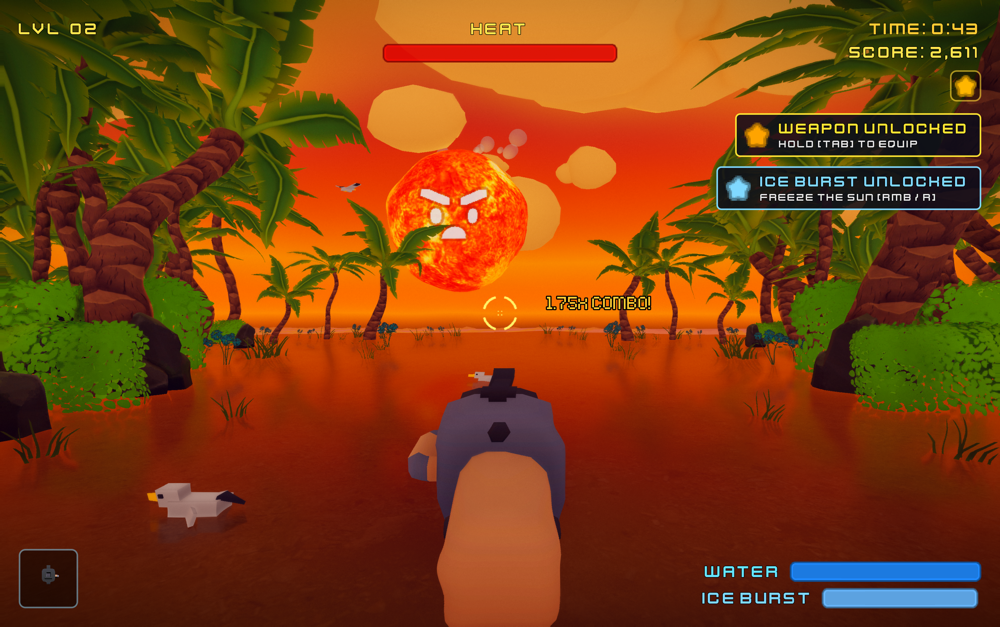<br><b>Notification Pop-Up</b></td>
  </tr>
</table>

---

## Key Features

* **Arcade Cooling Combat:** Douse the Sun before time expires or heat reaches 100%. Maintain continuous spray to build combo multipliers up to 3.0x for accelerated scoring and ultimate charging.
* **Special Abilities:** Fire **Ice Bursts (`R`)** to freeze heat gain and stop Sun movement, or unleash the screen-clearing **Catastrom Ultimate (`F`)** to dunk the Sun into the sea.
* **6 Unlockable Blasters:** Access a slow-motion weapon wheel (`TAB`) featuring distinct weapons, including the high-crit Precision Stream and the celestial **Kitsune Buster IX** (with Cannon and Melee Blade modes).
* **Dynamic Hazards & Bosses:** Intercept parabolic solar flares mid-air for instant water refills, fight through crosswind gusts, shatter mirage overshields, and conquer multi-phase boss encounters.
* **Game Modes:** Battle through 6 campaign levels in Normal Mode, or survive Endless Mode featuring rogue-lite perk drafting after boss waves.
* **Retro-Stylized Presentation:** Low-poly 3D aesthetics, procedural Gerstner ocean waves, custom GLSL sky and heat shaders, retro CRT/PS1 filters, and full accessibility options (gamepad support, high contrast, reduce motion).

---

## Controls

| Input | Action |
|---|---|
| Mouse | Aim water cannon |
| Left Click (Hold) | Spray water |
| Right Click / R | Fire Ice Burst (when charged) |
| F | Activate Catastrom Ultimate (100% charge) |
| Tab (Hold) | Open Weapon Selection Wheel |
| ESC | Pause / Settings |

---

## Running the Project

1. Download and open **Godot Engine 4.7.1** (stable).
2. In the Project Manager, click **Import** and select `project.godot`.
3. Click **Import & Edit**, then press **F5** to run.

---

## Project Structure

```
SummerNights-Godot/
├── assets/          # 3D models, textures, audio SFX, and shaders
├── docs/            # Architecture guides, HUD references, and changelog
├── scenes/          # Gameplay, HUD overlay, and menu scenes
└── scripts/         # Core game loop, weapon mechanics, and state management
```

---

## Tech Stack

| Area | Technology |
|---|---|
| Engine | Godot Engine 4.7.1 |
| Language | GDScript |
| Rendering | Forward+ (Metal / Vulkan) |
| Post-FX | Bloom, SSAO, SSIL, SSR, Volumetric Fog, Custom GLSL Shaders |

---

## Credits

0% Generative AI. All assets are hand-crafted, CC0 open-source, or procedural GDScript.

### Core Team
*   **Ash J** - Product Design & Direction
*   **Ivy** - UI & Visual Designer

### Special Thanks
*   **Yodi (요디님) & Kakao based Design Club** - Original Concept Inspiration

### Third-Party Assets

| Asset | Author | License |
|---|---|---|
| 3D Sun Model - PS1 Style Low Poly Sun | albert_buscio (Sketchfab) | CC0 |
| 3D Gun Model - 3D Blaster | Kenney | CC0 |
| 3D Gun Model - Kitsune Buster IX (Cannon & Blade) | Procedural Python glTF Synthesis | Open Source |
| 3D Model - Solar Eye Drone ("Helios Drone") | Procedural Python glTF Synthesis | Open Source |
| Foliage & Rocks - Ultimate Stylized Nature | Quaternius | CC0 |
| Sand Texture - Coast Sand 01 | Poly Haven | CC0 |
| Stylized Sky Shader | MinionsArt | CC0 |
| Stylized Water Shader | Jtfinlay | MIT |
| Heat Haze Screen Distortion | MinionsArt | CC0 |
| Font - Kenney Future | Kenney | CC0 |
| Font - Inter (Body Text) | Rasmus Andersson | SIL OFL |
| Font - Galmuri11 (Korean Support) | quiple | SIL OFL |
| UI Pack Adventure | Kenney | CC0 |
| Controller SVGs | Oscar Nilsson | CC0 |
| Godot Engine Logo & Branding | Andrea Calabró (Godot Foundation) | CC BY 4.0 |
| Menu & Achievement Icons | Game-icons.net | CC BY 3.0 |
| UI & Perk Vector Icons (Ice Spear, Cold Thermometer, Sun, Padlock, Drone, Shatter) | Game-icons.net (Lorc, Delapouite) | CC BY 3.0 |
| HUD Meter Icons | Yudhi Restu Pebriyanto, Jaya99, balyanbinmalkan (Noun Project) | CC BY 3.0 |
| UI - Celestial Starburst Meter Icon | Hand-crafted SVG Vector Icon | CC0 |
| SFX - 40 CC0 Water/Splash/Slime | OpenGameArt | CC0 |
| SFX - Water Gun Shot | belanhud (Freesound) | CC0 |
| SFX - UI Audio Pack | Kenney | CC0 |
| SFX - Ice Shoot | urupin (Freesound) | CC0 |
| SFX - Ice Hit | antonsoederberg (Freesound) | CC0 |
| SFX - Shield Shatter | IgnasD (OpenGameArt) | CC0 |
| SFX - Shield Materialize | bart (OpenGameArt) | CC0 |
| SFX - Shield Deflection | OpenGameArt | CC0 |
| SFX - Drone Metallic Impacts (4 variations) | rubberduck (OpenGameArt) | CC0 |
| SFX - Drone Mechanical Shatter & Glass Fragmentation | rubberduck (OpenGameArt) | CC0 |
| SFX - Kitsune Blade Draw & Melee Clashes | artisticdude (OpenGameArt) | CC0 |
| SFX - Tokusatsu Driver Lock & Cannon Lock | OpenGameArt | CC0 |
| SFX - Overdrive Alarm & Golden Forcefield Hum | Kenney | CC0 |
| SFX - Rogue-lite Perk Draft, Hover & Select | Kenney | CC0 |
| SFX - Celestial Awakening Activation | TheLittleCrow (Freesound) | CC0 |
| SFX - Celestial Awakening Deactivation | bevibeldesign (Freesound) | CC0 |
| SFX - Celestial Blade Slash | Nomagician (Freesound) | CC0 |
| SFX - Tactical Mode Switch | Kenney | CC0 |
| SFX - Seagull Ambiance | Half-Life | Mod Asset |
| SFX - PS1 Style Synth Boot Audio | nihilanth217 (SampleFocus) | Standard License |
| SFX - Heartbeat (Death's Door) | Wikimedia Commons | Public Domain |
| SFX - Empty Tank Click | Procedural Python Script Synthesis | Open Source |
| SFX - Supernova Impact Audio (Safe Export) | Uzbazur (Freesound) | CC0 |
| VFX - Ice Blast Projectile & Particles | Procedural Godot Primitives | - |
| VFX - Physical Magma Debris | Quaternius Rock Models & Godot RigidBody3D | - |
| VFX - Solar Flare Shield & Deflection Ripple | Procedural Fresnel Shader & Outward Splash Particles | - |
| Procedural Clouds & Avian-Rigged Seagulls | Hand-crafted GDScript & Skeletal Flight Model | - |
| VFX - Fireflies & Bugs | Procedural GDScript ArrayMesh | - |
| Sun Face Expressions | Procedural Godot Image draw API | - |
| Weapon Wheel UI | Procedural GDScript draw API | - |
| Dynamic Weapon Crosshairs | Procedural GDScript draw API | - |
| Stream Combo UI & Logic | Procedural GDScript & Tweens | - |
| Synthesized UI Audio (Ticks/Whoosh) | Procedural AudioStreamGenerator | - |
| VFX & Audio - Solar Wind Hazard | Procedural Particles & AudioStreamGenerator | - |
| UI Icon - Catastrom Powerup | pandora0226 (DeviantArt) | CC BY-NC-ND 3.0 (Used for fun) |
| SFX - Catastrom Dunk | Dual Mare Capsem Sound | Fair Use (Fan Project) |
| Heat Mirage Mechanic | Procedural Translucent Materials & Tweens | - |
| Boot Splash Frame & Curtain Reveal | Procedural CanvasItem Drawing & Vector Animation | - |
| VFX - Coronal Halo & Concentric Heat Ripples | Procedural Unshaded Additive Shader & Geometry | - |
| VFX - Flare Interception Golden Ember Pop | Procedural Radial Particles & Bloom | - |
| UI - Stats & Achievement Icon Plates | Procedural Retro Flat Plates & Tinted Vector Icons | - |
| VFX - Celestial Awakening 9-Tail Hydro-Ribbons | Procedural 3D Geometry & Waves | - |
| VFX - 9-Stream Converging Cannon & Creation Aura | Procedural Helical Vortex & Flare Deflection | - |
| VFX - Celestial Hydro-Blade & Water Cutting | Procedural Mesh Sheath & Orbiting Spirals | - |
| VFX - Ethereal Domain 3D Post-Process Shader | Split-Toning, Henshin Shockwave & Anamorphic Flares | - |
| VFX - Celestial Radial Energy Vignette Shader | Procedural Energy Pulsing & Stardust Motes | - |
| VFX - Celestial Foxfire Slash Wave | ImmediateMesh Flame Crescent & Trailing Spark Embers | - |

*Disclaimer: Kamen Rider and related characters (including Kamen Rider Zeztz & Kamen Rider Geats) are the property of Toei Company, Ltd. and Ishimori Productions. This game is a non-profit, unofficial fan work and is not affiliated with or endorsed by Toei Company.*
